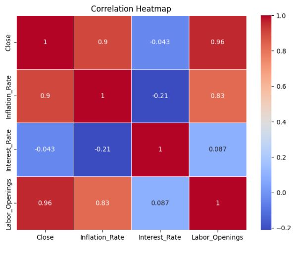

# **Financial Market Analysis and Prediction Project**

## **Overview**
This is my Financial Market Analysis and Prediction project simple approach atempt. This repository houses my exploration into data science and its application to financial markets. The goal of this project is to analyse historical market data and economic indicators, importing different datasets in order to identify trends, build predictive models, compare them and then using one to give a future price prediciton.

## **Project Structure**
### **1. Data Retrieval and Preprocessing**
I've used Python for fetching historical stock prices of the S&P 500 index from Yahoo Finance using the yfinance library. Additionally, economic indicators such as inflation rate, interest rate, and labor openings have been obtained from the Federal Reserve Economic Data (FRED) API using the fredapi library.

```
import yfinance as yf

# Define the ticker symbol for S&P 500 (SPY is the ETF that tracks it)
ticker_symbol = "SPY"

# Define the start and end dates for your data
start_date = "2000-12-01"
end_date = "2023-09-01"
sp500_data = yf.download(ticker_symbol, start=start_date, end=end_date)

from fredapi import Fred

# Initialize the FRED API client
fred = Fred(api_key=api_key)

# Define the series IDs for the economic indicators you want to retrieve
inflation_series_id = 'CPIAUCSL'  # Consumer Price Index for All Urban Consumers (CPI-U)
interest_rate_series_id = 'FEDFUNDS'  # Effective Federal Funds Rate
labor_openings_series_id = 'JTSJOL'  # Job Openings

# Fetch economic indicator data from FRED
inflation_data = fred.get_series(inflation_series_id,start=start_date, end=end_date)
interest_rate_data = fred.get_series(interest_rate_series_id,start=start_date, end=end_date)
labor_openings_data = fred.get_series(labor_openings_series_id,start=start_date, end=end_date)

```

### **2. Exploratory Data Analysis (EDA)**
To gain insights into the data, I've performed Exploratory Data Analysis using popular data analysis libraries like Pandas, Matplotlib, Seaborn, and NumPy. This includes visualizations of stock prices, inflation rates, interest rates, and labor openings over time.


### **3. Correlation Analysis**
I've explored the relationships between the S&P 500 index and economic indicators by calculating and visualizing the correlation matrix. This helps identify potential dependencies that could impact market movements.





### **4. Predictive Modeling**
I've implemented three different predictive models: Linear Regression, Random Forest, and Long Short-Term Memory (LSTM) Neural Network. These models in conjunction with indicators like moving averages, standard deviations, inflation rates, interest rates, and labor openings where combined to predict future price changes.

### **5. Model Evaluation**
Each model's performance has been assessed using metrics such as Mean Absolute Error (MAE), Mean Squared Error (MSE), Precision, Accuracy, and Z-Score. I've also conducted fit sampling experiments to evaluate model performance under different data distribution scenarios.

### **6. Model Comparison**
A comprehensive comparison table and visualizations showcase the strengths and weaknesses of each model, allowing for an informed choice depending on specific use cases.


### **7. Updating with Up-to-Date Data**
I've demonstrated how to update historical data with the latest information from Yahoo Finance and FRED API, ensuring that the analysis remains relevant and adaptable to changing market conditions.

## *Conclusion*
The project was successfull delivering a target price based on the previous data feeded into the model. Further experiment should be done with different data base and metrics for a more precise conclusion.  

You can find the link for the code [here](https://github.com/RafaelBaltazar/RafaelBaltazar.github.io/blob/40d8e7ec309342b35b137f1b8c5b03465961ad84/projects/market_prediction/market_prediction.ipynb).
